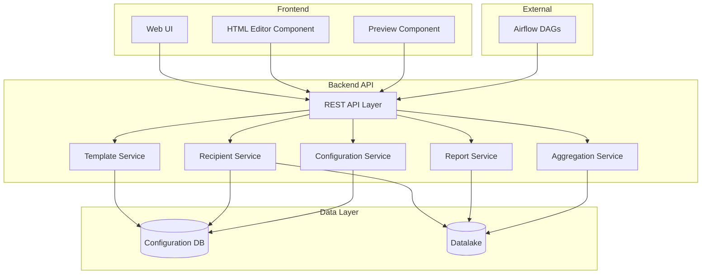
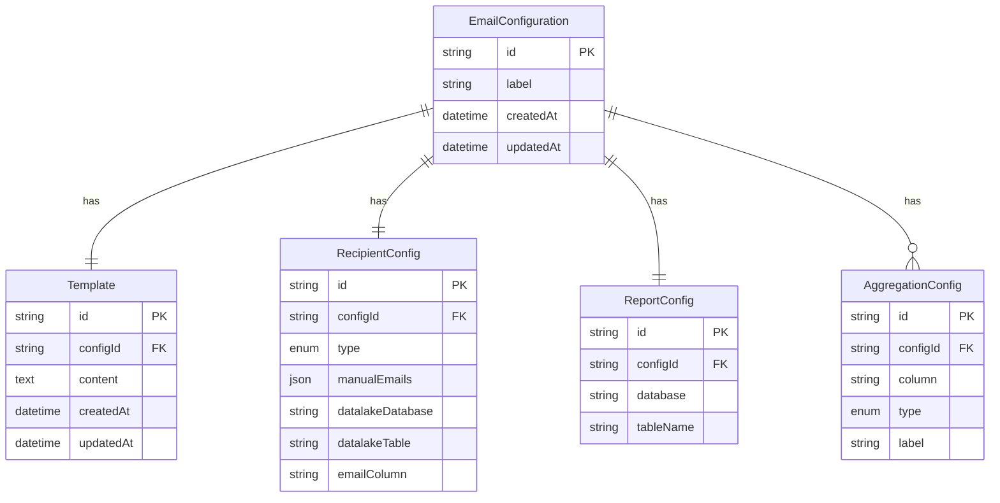

# Design Document: Jet Email Scheduler

## Overview

Jet is a web application that enables users to create, configure, and schedule automated email reports from datalake data. The system provides an HTML editor for email templates, flexible recipient management, report data selection with CSV export, and in-email aggregation display. Configurations are persisted and exposed for Airflow DAG consumption.

## Architecture

The system follows a layered architecture with clear separation between presentation, business logic, and data access layers.



## Components and Interfaces

### Template Service

Manages HTML email template CRUD operations.

```typescript
interface TemplateService {
  createTemplate(content: string): Promise<Template>;
  getTemplate(id: string): Promise<Template>;
  updateTemplate(id: string, content: string): Promise<Template>;
  deleteTemplate(id: string): Promise<void>;
  validateTemplate(content: string): ValidationResult;
}

interface Template {
  id: string;
  content: string;
  createdAt: Date;
  updatedAt: Date;
}

interface ValidationResult {
  isValid: boolean;
  errors: string[];
}
```

### Recipient Service

Manages recipient list configuration.

```typescript
interface RecipientService {
  setManualRecipients(configId: string, emails: string[]): Promise<RecipientConfig>;
  setDatalakeRecipients(configId: string, tableRef: TableReference): Promise<RecipientConfig>;
  getRecipients(configId: string): Promise<RecipientConfig>;
  validateEmail(email: string): boolean;
  resolveRecipients(configId: string): Promise<string[]>;
}

interface RecipientConfig {
  id: string;
  type: 'manual' | 'datalake';
  manualEmails?: string[];
  tableReference?: TableReference;
}

interface TableReference {
  database: string;
  table: string;
  emailColumn: string;
}
```

### Report Service

Manages report data source configuration and CSV generation.

```typescript
interface ReportService {
  setReportSource(configId: string, tableRef: TableReference): Promise<ReportConfig>;
  getReportSource(configId: string): Promise<ReportConfig>;
  validateTableExists(tableRef: TableReference): Promise<boolean>;
  generateCsv(tableRef: TableReference): Promise<Buffer>;
  getTableColumns(tableRef: TableReference): Promise<ColumnInfo[]>;
}

interface ReportConfig {
  id: string;
  tableReference: TableReference;
}

interface ColumnInfo {
  name: string;
  type: string;
}
```

### Aggregation Service

Manages aggregation definitions and computation.

```typescript
interface AggregationService {
  addAggregation(configId: string, aggregation: AggregationDef): Promise<AggregationConfig>;
  removeAggregation(configId: string, aggregationId: string): Promise<void>;
  getAggregations(configId: string): Promise<AggregationConfig[]>;
  computeAggregations(configId: string): Promise<ComputedAggregation[]>;
}

interface AggregationDef {
  column: string;
  type: 'sum' | 'average' | 'count' | 'min' | 'max';
  label: string;
}

interface AggregationConfig {
  id: string;
  configId: string;
  column: string;
  type: 'sum' | 'average' | 'count' | 'min' | 'max';
  label: string;
}

interface ComputedAggregation {
  label: string;
  value: number | string;
}
```

### Configuration Service

Manages complete email configurations.

```typescript
interface ConfigurationService {
  createConfiguration(label: string): Promise<EmailConfiguration>;
  getConfiguration(id: string): Promise<EmailConfiguration>;
  listConfigurations(): Promise<EmailConfiguration[]>;
  searchConfigurations(labelFilter: string): Promise<EmailConfiguration[]>;
  updateConfiguration(id: string, updates: Partial<EmailConfiguration>): Promise<EmailConfiguration>;
  deleteConfiguration(id: string): Promise<void>;
  exportForAirflow(id: string): Promise<AirflowConfig>;
}

interface EmailConfiguration {
  id: string;
  label: string;
  template: Template;
  recipientConfig: RecipientConfig;
  reportConfig: ReportConfig;
  aggregations: AggregationConfig[];
  createdAt: Date;
  updatedAt: Date;
}

interface AirflowConfig {
  configId: string;
  label: string;
  templateContent: string;
  recipientSource: RecipientConfig;
  reportTable: TableReference;
  aggregations: AggregationDef[];
}
```

### Preview Service

Generates email previews with rendered aggregations.

```typescript
interface PreviewService {
  generatePreview(configId: string): Promise<EmailPreview>;
  renderTemplate(template: string, aggregations: ComputedAggregation[]): string;
}

interface EmailPreview {
  renderedHtml: string;
  recipientCount: number;
  recipients: string[];
  aggregations: ComputedAggregation[];
  errors: string[];
}
```

## Data Models

### Database Schema



### JSON Serialization Format

Email configurations are serialized to JSON for Airflow consumption:

```json
{
  "configId": "uuid",
  "label": "Weekly Sales Report",
  "template": {
    "content": "<html>...</html>"
  },
  "recipients": {
    "type": "datalake",
    "tableReference": {
      "database": "users",
      "table": "subscribers",
      "emailColumn": "email"
    }
  },
  "report": {
    "database": "sales",
    "table": "weekly_summary"
  },
  "aggregations": [
    {
      "column": "revenue",
      "type": "sum",
      "label": "Total Revenue"
    }
  ]
}
```


## Correctness Properties

*A property is a characteristic or behavior that should hold true across all valid executions of a system—essentially, a formal statement about what the system should do. Properties serve as the bridge between human-readable specifications and machine-verifiable correctness guarantees.*

### Property 1: Template Persistence Round-Trip

*For any* valid HTML template content, saving the template and then retrieving it should return content equivalent to the original.

**Validates: Requirements 1.2, 1.3**

### Property 2: Empty Template Rejection

*For any* string that is empty or contains only whitespace characters, attempting to save it as a template should be rejected with a validation error.

**Validates: Requirements 1.4**

### Property 3: Template Update Persistence

*For any* existing template and any new valid HTML content, updating the template should result in subsequent retrievals returning the new content.

**Validates: Requirements 1.5**

### Property 4: Email Validation Correctness

*For any* string, the email validator should return true if and only if the string matches a valid email format (contains exactly one @ symbol, has non-empty local and domain parts, and domain contains at least one dot).

**Validates: Requirements 2.3**

### Property 5: Recipient Configuration Round-Trip

*For any* valid recipient configuration (manual list or datalake reference), saving and then retrieving should return an equivalent configuration.

**Validates: Requirements 2.5**

### Property 6: Report Configuration Round-Trip

*For any* valid table reference, saving the report configuration and retrieving it should return an equivalent table reference.

**Validates: Requirements 3.2**

### Property 7: CSV Export Completeness

*For any* table data with N rows and M columns, the generated CSV should contain exactly N data rows plus one header row, and each row should contain exactly M comma-separated values.

**Validates: Requirements 3.3**

### Property 8: Aggregation Computation Correctness

*For any* numeric column data and aggregation type (sum, average, count, min, max), the computed aggregation value should equal the mathematically correct result for that operation on the data.

**Validates: Requirements 4.2**

### Property 9: Template Placeholder Replacement

*For any* template containing aggregation placeholders and a set of computed aggregations, rendering the template should replace each placeholder with its corresponding computed value, and the rendered output should contain no unresolved placeholders.

**Validates: Requirements 4.4, 4.5**

### Property 10: Preview Generation Completeness

*For any* valid email configuration, generating a preview should produce rendered HTML containing all computed aggregation values, and the preview should include the correct recipient count.

**Validates: Requirements 5.1, 5.2, 5.3**

### Property 11: Configuration Label Required

*For any* attempt to save an email configuration without a label (empty or whitespace-only), the save operation should fail with a validation error.

**Validates: Requirements 6.1**

### Property 12: Full Configuration Round-Trip

*For any* complete email configuration (label, template, recipients, report, aggregations), saving and then retrieving should return an equivalent configuration with all components intact.

**Validates: Requirements 6.2, 6.5**

### Property 13: Configuration Listing Completeness

*For any* set of N saved configurations, listing all configurations should return exactly N items, each with its label.

**Validates: Requirements 6.3**

### Property 14: Configuration Search Filtering

*For any* search term and set of saved configurations, the search results should contain only configurations whose labels contain the search term (case-insensitive), and should contain all such matching configurations.

**Validates: Requirements 6.4**

### Property 15: Configuration Deletion

*For any* saved configuration, after deletion, attempting to retrieve that configuration should fail or return not found.

**Validates: Requirements 6.6**

### Property 16: Airflow Export Serialization Round-Trip

*For any* valid email configuration, exporting to Airflow format and parsing the resulting JSON should produce data equivalent to the original configuration.

**Validates: Requirements 6.7**

## Error Handling

### Validation Errors

| Error Condition | Response |
|----------------|----------|
| Empty template content | Return validation error with message "Template content cannot be empty" |
| Invalid email format | Return validation error with message "Invalid email format: {email}" |
| Empty configuration label | Return validation error with message "Configuration label is required" |
| Non-existent table reference | Return error with message "Table {database}.{table} does not exist" |
| Invalid aggregation column | Return error with message "Column {column} does not exist in table" |
| Non-numeric column for numeric aggregation | Return error with message "Column {column} is not numeric" |

### System Errors

| Error Condition | Response |
|----------------|----------|
| Database connection failure | Return 503 Service Unavailable with retry guidance |
| Datalake connection failure | Return 503 Service Unavailable with retry guidance |
| Configuration not found | Return 404 Not Found |
| Concurrent modification conflict | Return 409 Conflict with current version |

## Testing Strategy

### Unit Tests

Unit tests verify specific examples and edge cases:

- Template validation with various empty/whitespace inputs
- Email validation with known valid and invalid formats
- Aggregation computation with specific numeric datasets
- Placeholder replacement with known template/value pairs
- JSON serialization/deserialization of configuration objects

### Property-Based Tests

Property-based tests verify universal properties across randomly generated inputs. Use a property-based testing library (e.g., fast-check for TypeScript, Hypothesis for Python).

**Configuration:**
- Minimum 100 iterations per property test
- Each test must reference its design document property
- Tag format: **Feature: jet-email-scheduler, Property {number}: {property_text}**

**Properties to implement:**
1. Template round-trip persistence
2. Empty template rejection
3. Email validation correctness
4. Recipient configuration round-trip
5. Report configuration round-trip
6. CSV export row/column count
7. Aggregation computation correctness
8. Placeholder replacement completeness
9. Configuration round-trip
10. Search filtering correctness
11. Airflow export round-trip

### Integration Tests

- End-to-end configuration creation and retrieval
- Preview generation with live datalake data
- Airflow export format validation
- Multi-component configuration updates
